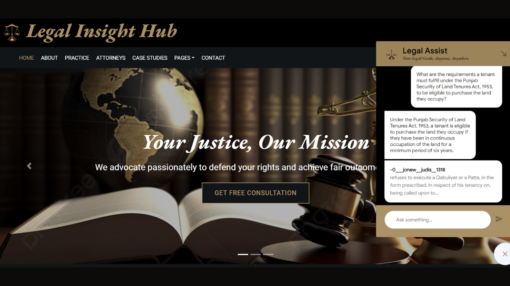

# Legal Assist Chatbot

**Microsoft RAGHack Hackathon 2024 Project**


## Table of Contents

- [Introduction](#introduction)
- [Problem Statement](#problem-statement)
- [Solution Overview](#solution-overview)
- [Technologies Used](#technologies-used)
- [Architecture](#architecture)
- [Key Features](#key-features)
- [Setup and Installation](#setup-and-installation)
- [Usage](#usage)
- [Future Improvements](#future-improvements)
- [Data Privacy and Security](#data-privacy-and-security)
- [Key Issues Foreseen](#key-issues-foreseen)
- [Contributing](#contributing)
- [Acknowledgements](#acknowledgements)
- [License](#license)

## Introduction

The **Legal Assist Chatbot** is a multilingual conversational AI tool designed to provide legal information and summarize court documents in English and various scheduled Indian languages. This project was developed for the Microsoft RAGHack Hackathon 2024, addressing the need for accessible legal information in India.



## Problem Statement

To develop an artificial intelligence-based model for a conversational use-case chatbot in English and the scheduled languages of the Constitution of India, 1950, to answer queries about case-related information, summarization of judgments, court documents, etc.

## Solution Overview

Our solution is a multilingual legal chatbot that leverages the capabilities of Azure AI Search with Retrieval-Augmented Generation (RAG). The chatbot is designed to:
- Provide accurate answers to legal queries.
- Summarize judgments and retrieve relevant court documents.
- Support multiple Indian languages for wider accessibility.
- Ensure compliance with data privacy regulations.

The chatbot is built using Azure's scalable cloud platform, enabling it to handle large volumes of queries efficiently and provide a seamless user experience.

## Technologies Used

- **Azure AI Search:** For powerful, AI-enhanced search capabilities across legal documents.
- **Azure AI Studio:** To develop and deploy AI models tailored for legal language processing.
- **Azure Cosmos DB:** For storing and managing large volumes of legal data efficiently.
- **Retrieval-Augmented Generation (RAG):** For enhanced natural language processing and information retrieval.
- **Flask:** Used for creating the chatbot's web interface.
- **Azure Machine Learning:** For training and deploying custom ML models.

## Architecture


The Legal Assist Chatbot follows a multi-stage RAG architecture leveraging Azure services:

1. **Question Input:** The user poses a legal question through the Flask web interface.
2. **Azure AI Search:** Performs semantic search using embeddings to find relevant legal documents.
3. **Azure Cosmos DB:** Stores legal data as vector representations for efficient retrieval.
4. **Azure AI Studio:** Houses the Large Language Model (LLM) that generates natural language responses based on retrieved context.
5. **Post-Processing:** Refines and ensures the quality of the generated response using custom logic.
6. **Response Output:** Presents the final answer to the user through the web interface.

## Key Features

- Multilingual support for Indian languages
- Legal document summarization
- Case-related information retrieval
- Integration with Azure AI services for scalability and performance
- User-friendly web interface

## Setup and Installation

1. Clone the repository:
   ```
   git clone https://github.com/your-repo/legal-assist-chatbot.git
   ```

2. Install dependencies:
   ```
   pip install -r requirements.txt
   ```

3. Set up Azure resources:
   - Create an Azure AI Search service
   - Set up Azure Cosmos DB
   - Configure Azure AI Studio

4. Set environment variables:
   ```
   export AZURE_SEARCH_SERVICE_ENDPOINT="your_endpoint"
   export AZURE_SEARCH_INDEX_NAME="your_index_name"
   export AZURE_SEARCH_API_KEY="your_api_key"
   export COSMOS_DB_CONNECTION_STRING="your_connection_string"
   ```

5. Run the Flask application:
   ```
   python app.py
   ```

## Usage

1. Access the chatbot through the web interface at `http://localhost:5000`.
2. Type your legal query in the chat box.
3. The chatbot will process your query and provide relevant information or document summaries.
4. For language selection, use the dropdown menu to choose your preferred language.

## Future Improvements

- Expand language support to include more Indian languages and dialects.
- Implement advanced NLP models for better context understanding.
- Add voice support for enhanced user experience.
- Incorporate real-time legal updates to ensure the most current information.
- Extend accessibility by deploying the chatbot on various platforms like mobile apps and social media.

## Data Privacy and Security

- All data is processed and stored within Azure's secure cloud environment.
- Strict access controls and encryption are implemented to protect sensitive legal information.
- Compliance with Indian data protection laws and regulations is ensured.

## Key Issues Foreseen

- Keeping the legal database up-to-date with the latest judgments and amendments.
- Ensuring accuracy in language translation for legal terminologies.
- Scaling the system to handle high volumes of concurrent users.

## Contributing

We welcome contributions to the Legal Assist Chatbot project. Please read our [CONTRIBUTING.md](CONTRIBUTING.md) file for guidelines on how to submit contributions.

## Acknowledgements

- Microsoft for providing the Azure platform and organizing the RAGHack Hackathon.
- The open-source community for various tools and libraries used in this project.
- Legal experts who provided guidance on Indian law and legal processes.

## License

This project is licensed under the MIT License - see the [LICENSE.md](LICENSE.md) file for details.